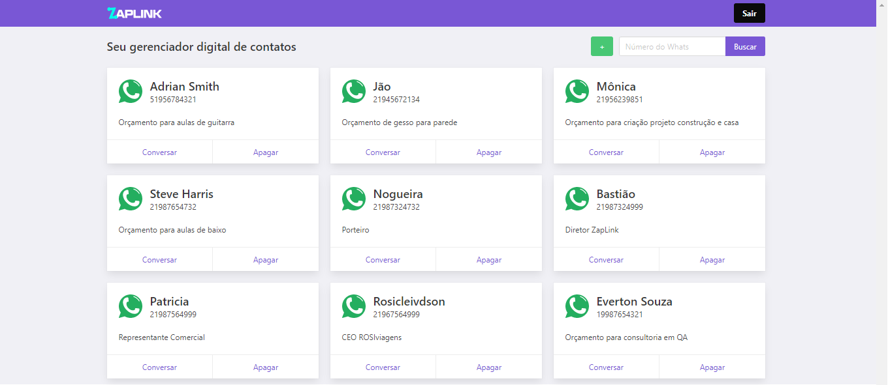

# 🔗 Zaplink - Vue.js Application with Cypress Tests

Study project combining **frontend development, backend services, and end-to-end test automation**.

The application was built with **Vue.js** on the frontend and **Node.js** on the backend, with automated functional tests implemented using **Cypress**.

The project was created as part of my studies to better understand the complete application flow and apply automated testing from a QA perspective.

## 🛠 Tech Stack

### Frontend
- Vue.js
- JavaScript
- Yarn

### Backend
- Node.js
- JavaScript
- REST APIs

### Test Automation
- Cypress
- Mochawesome Report

## 🎯 Project Purpose

The main goal of this project was to explore the relationship between application development and test automation.

Instead of working only with an external application under test, this project includes both the application code and the automated test suite.

Topics explored include:

- Frontend development with Vue.js
- Backend API development with Node.js
- End-to-end web test automation
- User authentication flows
- UI interaction and validation
- Automated test reports
- Understanding application behavior from both development and QA perspectives

## 📁 Project Structure

```text id="8d6v7v"
estudoVueJsCypress_zaplink/
├── backend/
│   ├── Controllers/
│   ├── models/
│   ├── routes/
│   ├── tests/
│   ├── server.js
│   └── package.json
│
├── frontend/
│   ├── src/
│   ├── tests/
│   ├── public/
│   ├── cypress.json
│   ├── mochawesome-report/
│   └── package.json
│
├── dashboard.png
├── loginPage.png
└── README.md
```

## 🖥 Application

The project contains a web application with authentication and dashboard functionality.

### Login


### Dashboard



## 🧪 Cypress Test Automation

The frontend project includes automated end-to-end tests using Cypress.

The tests are located under:

```text id="mytfgq"
frontend/tests
```

Cypress configuration is defined in:

```text id="hi24gy"
frontend/cypress.json
```

The automated tests were created to validate user flows and application behavior through the browser.

## 📊 Test Reporting

The project uses **Mochawesome** to generate HTML test execution reports.

Generated reports are located under:

```text id="ktmh9v"
frontend/mochawesome-report
```

## ⚙️ Installation

The project contains separate frontend and backend applications.

### Backend

Navigate to:

```bash id="6i0xvd"
cd backend
```

Install the dependencies:

```bash id="v7kqr8"
yarn install
```

Start the backend using the scripts available in `package.json`.

### Frontend

Navigate to:

```bash id="w0rqhy"
cd frontend
```

Install the dependencies:

```bash id="ucihid"
yarn install
```

Start the Vue.js application using the scripts defined in `package.json`.

## ▶️ Running the Automated Tests

From the frontend directory, Cypress can be executed using the project scripts or directly with Cypress.

Example:

```bash id="mrptjx"
npx cypress open
```

or in headless mode:

```bash id="xp9o1j"
npx cypress run
```

## 📚 Learning Context

This repository was created as a study project combining **web development and QA automation**.

It helped me explore both sides of a web application:

- How the frontend communicates with the backend
- How application flows are implemented
- How end-to-end tests validate real user behavior
- How automated test reports can be generated and analyzed

## 📌 Project Status

This is an older study/reference project and some dependencies may no longer reflect the latest Vue.js, Node.js, or Cypress ecosystem.

The repository is maintained as part of my QA automation portfolio to demonstrate my learning experience with **Cypress, Vue.js, Node.js, and end-to-end web testing**.
